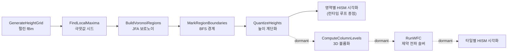

# LastStand

언리얼 엔진 5 · C++로 만든 서버 권위(Server-Authoritative) 멀티플레이 3인칭 슈터입니다. 개인 프로젝트로 설계와 C++ 게임플레이/네트워크/툴 구현을 전반적으로 진행했습니다.

주로 다룬 부분은 절차적 맵 생성(WFC), 랙 보상(서버사이드 리와인드), 서버 권위 + 클라이언트 예측 네트워킹입니다. 셋 다 UE 기본 제공 기능이 아니라 직접 구현했습니다.

사용 기술: UE5(소스 빌드), C++, Enhanced Input, GameplayTags, Online Subsystem, UMG.

<!-- 대표 GIF/스크린샷 삽입 위치 (WFC로 생성된 맵 & 인게임 플레이) -->

---

## WFC 절차적 맵 생성

맵 생성기는 독립 Runtime 플러그인 `MapGenerator`로 분리했습니다. 게임 모듈과 디커플되어 재사용과 독립 컴파일이 가능하고, `UWorldSubsystem`으로 레벨별 수명을 갖습니다.

전체 흐름은 2D 높이 필드로 영역을 만드는 단계(Stage A)와, 그 위에서 3D 타일을 푸는 WFC 단계(Stage B)로 나뉩니다. **현재 런타임 루프는 Stage A(영역 생성)까지만 구동하고, Stage B(WFC)는 코드/데이터로만 보존된 dormant 상태**입니다 — 컴파일·API 호출은 가능하되 생성 루프에서는 제외되고, 관련 데이터 테이블(`DT_MapAssetData`/`DT_MapWFCData`)은 지연 로드됩니다.



### Stage A — 높이 필드 생성과 후처리

- fBm(fractional Brownian motion): 다중 옥타브 `PerlinNoise2D`에 옥타브별 시드 오프셋을 주고, `Persistence`(진폭 감쇠)와 `Lacunarity`(주파수 증가)를 적용한 뒤 진폭 합으로 정규화해 [-1, 1] 범위로 맞춥니다.
- JFA 보로노이 영역화: 8방향 극댓값을 시드로 잡고(인접 플래토는 병합), Jump Flooding Algorithm으로 각 셀을 최근접 시드 영역으로 라벨링합니다. 파워오브투 halving step과 핑퐁 버퍼를 쓰고, 거리는 제곱 유클리드(int64, sqrt 없음)로 계산합니다.
- 경계 BFS: 서로 다른 영역이 맞닿는 경계를 다중 소스 거리 제한 BFS로 두께만큼 확장해 경계 존을 만듭니다.
- 높이 양자화: `GridSnap`으로 높이를 이산 계단으로 만들어 타일 적층에 맞는 지형이 되게 합니다.

런타임 시각화는 높이 값을 데이터로만 유지하고, 각 셀을 평면에 배치하되 보로노이 영역별로 색을 구분합니다(`AMapGridVisualizer`).

### Stage B — WFC 솔버 (`RunWFC`, dormant)

> Stage B는 현재 생성 루프에서 제외된 보존 코드입니다. `UMapGeneratorSubsystem::GenerateTileGrid`로 직접 호출하거나 `AMapWFCVisualizer`로 시각화할 수 있습니다.

- 소켓 비트마스크 인접: 모든 소켓 `FName`을 비트 인덱스(0–63)로 인터닝하고, 타일 6면을 각각 `uint64` 마스크로 표현합니다. 두 면은 마스크 교집합이 있으면 인접을 허용합니다(`(a & b) != 0`). 정확 일치보다 규칙을 유연하게 쓸 수 있습니다.
- 사전계산 호환 테이블 `Compatible[dir][tile]`과 `TArray<uint32>` 워드 단위 비트셋을 써서 제약 검사를 비트 연산으로 처리합니다(`Bits &= Bits-1` 순회, `CountBits`/`CountTrailingZeros`).
- 희소 솔브: 열 높이로 판정한 솔리드 셀만 처리합니다(전체 W×H×D 박스가 아님). 경계 소켓(`Empty`/`Floor`) 조건은 초기 아크 일관성 전파로 안쪽에 밀어 넣습니다.
- Observe → Collapse → Propagate: 남은 후보가 가장 적은 셀을 고르고(동률은 리저버 샘플링), 가장 높은 `Weight` 타일로 붕괴시킨 뒤, 워크리스트 기반으로 제약을 전파하며 모순을 감지합니다.
- 모순 복구: 붕괴 루프를 `MaxAttempts = 20` 재시도로 감싸고, 시도마다 `FRandomStream(Seed + Attempt)`로 리시드합니다. `WFCSeed`로 결과의 결정성을 보장합니다.

```cpp
// WFC 솔버 내부 타일 표현 — FName은 최초 인터닝 시에만, hot loop는 전부 int/비트마스크
struct FWFCTile
{
    FName  RowName;                                 // 카탈로그 인덱스 → 원본 행(메쉬 조회)
    float  Weight = 1.0f;                           // 가중치(동률은 리저버 샘플링)
    uint64 SocketMasks[6] = { 0,0,0,0,0,0 };        // +X,-X,+Y,-Y,+Z,-Z 면 소켓 비트마스크
};
```

시각화는 타일 타입별로 HISM(Hierarchical Instanced Static Mesh) 컴포넌트를 지연 생성합니다. per-axis `FVector CellSize`로 X/Y 풋프린트와 Z 층 높이를 따로 두어 다수의 타일을 인스턴싱으로 그립니다.

관련 코드: `Plugins/MapGenerator/Source/MapGenerator/` — 영역 생성: `MapGeneratorSubsystem`(+`MapGeneratorSubsystem_WFC.cpp` dormant), `MapGrid`, `MapData`, `MapGridVisualizer`(영역 시각화). WFC(dormant): `MapTileGrid`, `MapAssetData`, `MapWFCData`, `MapWFCVisualizer`

<!-- WFC 파이프라인 단계별 시각화 GIF 삽입 위치 (노이즈 → 보로노이 → 타일 솔브) -->

---

## 서버사이드 리와인드 (랙 보상)

핑이 높은 클라이언트도 쏜 순간 화면에 보이던 위치로 명중 판정이 되도록, 히트박스 히스토리 기반 랙 보상을 구현했습니다.

- 히스토리 기록(`ULSServerSideRewindComponent`, 서버 전용 틱): `RecordInterval = 20ms`마다 히트박스별 스냅샷(월드 위치/회전/스케일된 박스 크기)을 `TMap<FName, FHitBoxSnapshot>`으로 저장하고, `HistoryEndOffset = 200ms`를 넘긴 스냅샷은 FIFO로 제거합니다.
- 되감기 판정(`ConfirmHit(start, end, timestamp)`): 발사 타임스탬프를 감싸는 두 스냅샷을 찾아 위치/크기는 `Lerp`, 회전은 `Slerp`로 보간하고(`InterpolateBox`), 레이를 박스 로컬 공간으로 변환해 세그먼트 vs OBB 판정을 합니다(`LineBoxIntersection`). 그 뒤 매칭되는 현재 히트박스를 반환합니다.
- 제네릭 수집: `ILSHitboxInterface::GetHitboxComponents()`로 히트박스를 추상적으로 모으므로, 인터페이스만 구현하면 플레이어든 적이든 동일하게 동작합니다.
- 정확도 관련: 데디케이티드 서버는 렌더링이 없어도 소켓 부착 히트박스가 정확해야 하므로 `VisibilityBasedAnimTickOption = AlwaysTickPoseAndRefreshBones`로 본을 항상 갱신합니다.

```cpp
// 서버: 클라가 보고한 피격 대상을 리와인드로 재검증한 뒤에만 권위 데미지 적용
if (ULSServerSideRewindComponent* SSR = HitActor->GetComponentByClass<ULSServerSideRewindComponent>())
{
    if (ULSHitboxComponent* Hitbox = SSR->ConfirmHit(TraceStart, TraceEnd, Timestamp))
    {
        Hitbox->ProcessServerHit(Damage);   // 부위 배율 적용 + 권위 데미지
    }
}
```

관련 코드: `Source/LastStand/Character/Components/LSServerSideRewindComponent.*`, `LSHitboxComponent.*`

---

## 서버 권위 + 클라이언트 예측 네트워킹

반응성(로컬 예측)과 서버 권위를 함께 챙기기 위한 네트워크 규율을 일관되게 적용했습니다.

히트스캔 발사 파이프라인:

1. 로컬 예측(소유 클라): 카메라 기준 스프레드 콘 트레이스를 즉시 실행하고 발사 몽타주, 머즐/임팩트 FX, 예측 데미지 넘버 UI를 바로 반영합니다.
2. 서버 RPC: `ServerRPCFire(Start, End, HitActor, Timestamp)`로 서버 월드 시간 타임스탬프를 함께 보냅니다.
3. 서버 검증: 연사 속도 가드(`Now - LastFire < Interval * 0.9`) 후 탄약을 차감하고, 서버사이드 리와인드로 재검증한 뒤 권위 데미지를 적용합니다.
4. 멀티캐스트 연출: 몽타주와 FX를 `NetMulticast Unreliable`로 전파하되 소유 클라는 스킵합니다(이미 로컬에서 재생). 연출이 두 번 나오지 않게 합니다.

리플리케이션 패턴:

| 패턴 | 용도 | 예시 |
|------|------|------|
| `ReplicatedUsing = OnRep_X` | 상태 전파와 클라 후처리. 서버는 OnRep이 발화하지 않으므로 직접 브로드캐스트 | `CurrentHealth`, `CurrentAmmo` |
| `COND_SkipOwner` | 소유 클라가 이미 예측한 상태는 되돌리지 않고 타 클라에만 전파 | `bIsAim` |
| `Reliable` RPC | 상태 전환(엣지 트리거). 드롭 시 고착 방지 | `ServerRPCAim`, `ServerRPCReload` |
| `Unreliable` Multicast | 고빈도 연출(발사/재장전 몽타주·FX) | `MulticastRPCPlayFireEffects` |
| `FFastArraySerializer` | 인벤토리 배열 델타 리플리케이션 | `FInventoryItemInfoArray` |

관련 코드: `Source/LastStand/Item/Equipment/Weapon/LSWeaponHitscan.*`, `Character/LSPlayerCharacter.*`

---

## 엔진 아키텍처 / 데이터 드리븐

- 컴포넌트 조합 + 인터페이스 분리: `ALSCharacterBase`는 Stat/Inventory/Interact 인터페이스를, `ALSEnemyBase`는 Stat/Hitbox 인터페이스를 구현합니다. 그래서 무기나 리와인드 같은 공용 시스템이 공통 베이스 클래스 없이 하나의 코드 경로로 플레이어와 적을 모두 다룹니다.
- 데이터 드리븐 코어: `UDeveloperSettings`(`ULSGameDataSettings`) → `ULSDataSubsystem`(`FindItem`/`FindWeapon`/`FindEnemy`) → `FTableRowBase` 행 조회 구조입니다. 에셋은 하드 레퍼런스를 쓰지 않고 `TSoftObjectPtr`/`TSoftClassPtr`로 참조한 뒤 사용 시점에 `LoadSynchronous` 합니다.
- 인벤토리/장비: `FFastArraySerializer` 델타 인벤토리, 리플리케이트 장비 맵(TMap는 배열로 우회 복제 후 클라에서 재구성), 인벤토리 델타를 구독하는 리플리케이트 탄약 캐시로 구성됩니다.
- 태그 기반 레이어드 UI: `ULSUISubsystem`(`FGameplayTag` 키 레이어/슬롯, 미등록 슬롯용 지연 주입 큐, 입력 모드 관리)과 `ULSUIEventSubsystem`(멀티캐스트 이벤트 버스)으로 게임플레이와 HUD를 분리했습니다. 데미지 넘버는 오브젝트 풀링을 씁니다.
- 무기 연출: 무기별 애님 레이어 링크(`LinkAnimClassLayers`), 런타임 커브 생성과 `FTimeline` 기반 ADS 줌, `EWeaponMontageType` 맵 기반 몽타주 디스패치(역재생 지원)를 구현했습니다.

---

## 프로젝트 구조

```
LastStand/
├─ Source/LastStand/
│  ├─ Character/          플레이어 캐릭터·베이스
│  │  └─ Components/      Stat / Equipment / Inventory / Interaction / Hitbox / ServerSideRewind
│  ├─ AI/                 EnemyBase(Pawn) + AIController(BehaviorTree 구동)
│  ├─ Item/Equipment/Weapon/   장비·무기 베이스, 히트스캔 무기
│  ├─ UI/                 UISubsystem·이벤트버스·레이어/슬롯 위젯, Widget/, Operation/
│  ├─ Data/               CharacterControl·Weapon·GameModeInfo 데이터 애셋
│  ├─ DataTable/          DataSubsystem + Item/Weapon/Enemy 행 구조체
│  ├─ Interface/          Stat/Hitbox/Inventory/Interact/Interactable 인터페이스
│  ├─ Settings/           GameDataSettings (UDeveloperSettings)
│  ├─ Player/ GameState/ Gamemode/ Props/ Animation/ Save/ Tags/
└─ Plugins/MapGenerator/  WFC 절차적 맵 생성 (독립 Runtime 플러그인)
```

---

## 개발 환경

- 엔진: 언리얼 엔진 5 소스 빌드
- 모듈 의존성: Core / CoreUObject / Engine / InputCore / EnhancedInput / UMG / GameplayTags / NetCore / Slate / SlateCore, (Private) OnlineSubsystem
- 게임플레이 관련 코드 주석은 한국어로 작성
