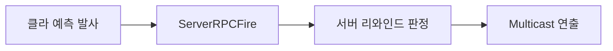
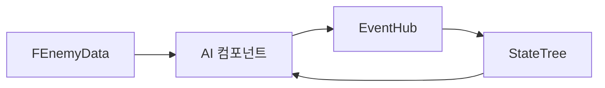
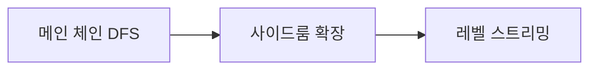

# LastStand

언리얼 엔진 5(소스 빌드)와 C++로 만든 서버 권위 방식의 멀티플레이 3인칭 슈터입니다.

<!-- 대표 GIF -->

주요 구현

- [네트워크 전투](#1-네트워크-전투): 클라이언트 예측, 서버사이드 리와인드, CMC 이동 예측
- [보스 AI](#2-보스-ai): StateTree와 DataTable 기반의 서버 전용 AI
- [절차적 던전 생성](#3-절차적-던전-생성): 방 서브레벨을 문 단위로 연결하는 플러그인

기술 스택: UE5, C++, Dedicated Server, StateTree, Enhanced Input, GameplayTags, Niagara, UMG

---

## 1. 네트워크 전투

### 발사 흐름


```mermaid
flowchart LR
    A[클라 예측 발사] --> B[ServerRPCFire]
    B --> C[서버 리와인드 판정]
    C --> D[Multicast 연출]
```

- 소유 클라이언트가 먼저 트레이스, 몽타주, 이펙트, 데미지 넘버를 처리하고 `ServerRPCFire(Start, End, HitActor)`를 보냅니다.
- 서버는 연사 간격(`Interval * 0.9`)과 탄약을 확인한 뒤 리와인드로 명중을 다시 판정하고 데미지를 적용합니다.
- 연출은 `NetMulticast Unreliable`로 보내고, 이미 재생한 소유 클라이언트는 `IsLocallyControlled()`로 건너뜁니다.
- 히트스캔 전용 트레이스 채널을 두고 Pawn 프로파일에서는 무시하도록 해서, 캡슐이 아니라 부위별 히트박스(머리 2.0, 약점 3.0, 팔다리 0.7)에만 맞게 했습니다.

### 서버사이드 리와인드

- 서버에서 20ms마다 히트박스의 위치, 회전, 크기를 기록하고 200ms 동안 보관합니다.
- 되감는 시간은 클라이언트가 보낸 값이 아니라 서버가 측정한 쏜 사람의 핑(RTT)을 사용하며, 최대 200ms로 제한합니다.
- 해당 시점 앞뒤 스냅샷을 `Lerp`/`Slerp`로 보간하고, 레이를 박스 로컬 공간으로 옮겨 OBB 교차를 검사합니다.
- 히트박스는 `ILSHitboxInterface`로 가져오기 때문에 플레이어와 적에 같은 코드를 사용합니다.
- 데디 서버에서도 본 위치가 갱신되도록 `AlwaysTickPoseAndRefreshBones`를 사용합니다.

```cpp
// 일부 생략
float RewindTime = Shooter->GetPlayerState()->GetPingInMilliseconds() * 0.001f;
const float QueryTime = Now - FMath::Clamp(RewindTime, 0.0f, HistoryEndOffset);

Alpha = (QueryTime - Before->Time) / (After->Time - Before->Time);
const FHitBoxSnapshot Box = InterpolateBox(Pair.Value, *BoxB, Alpha);
if (SegmentIntersectsBox(Box, TraceStart, TraceEnd)) { /* 히트박스 반환 */ }
```

### 이동 예측

- `UCharacterMovementComponent`를 상속해 달리기와 대시를 별도 RPC 없이 CMC 예측 흐름 안에서 처리합니다.
- `FSavedMove_LS`에 달리기/대시 입력을 저장하고 `FLAG_Custom_0/1` 압축 플래그로 서버에 보냅니다. 서버는 `UpdateFromCompressedFlags`로 값을 복원합니다.
- 대시는 `FRootMotionSource_ConstantForce`를 사용해 서버 보정과 리플레이에 포함됩니다.
- 대시 요청이 있는 move는 `CanCombineWith`에서 합치지 않습니다.
- 리플레이 중에 현재 프레임 입력이 과거 값으로 덮이지 않도록 `ClientUpdatePositionAfterServerUpdate` 전후로 입력을 보존합니다.

관련 코드: [LSWeaponHitscan.h](Source/LastStand/Item/Equipment/Weapon/LSWeaponHitscan.h) · [.cpp](Source/LastStand/Item/Equipment/Weapon/LSWeaponHitscan.cpp), [LSServerSideRewindComponent.h](Source/LastStand/Character/Components/LSServerSideRewindComponent.h) · [.cpp](Source/LastStand/Character/Components/LSServerSideRewindComponent.cpp), [LSHitboxComponent.h](Source/LastStand/Character/Components/LSHitboxComponent.h) · [.cpp](Source/LastStand/Character/Components/LSHitboxComponent.cpp), [LSCharacterMovementComponent.h](Source/LastStand/Character/Components/LSCharacterMovementComponent.h) · [.cpp](Source/LastStand/Character/Components/LSCharacterMovementComponent.cpp)

---

## 2. 보스 AI

여러 플레이어가 함께 상대하는 보스입니다. 판단은 서버에서만 하고, 몬스터마다 다른 행동, 서브트리, 타깃 규칙, 페이즈는 `FEnemyData` 행에서 설정합니다.

<!-- 보스 교전 GIF -->


```mermaid
flowchart LR
    D[FEnemyData] --> C[AI 컴포넌트]
    C --> E[EventHub]
    E --> S[StateTree]
    S --> C
```

### 이벤트 허브

- 퍼셉션, 체력, 사망에서 발생한 이벤트를 `ULSAIEventHubComponent::SendEvent`로 StateTree에 전달합니다. `AI.Event` 하위 태그만 허용합니다.
- possess가 `BeginPlay`보다 늦을 수 있어 StateTree 컴포넌트는 처음 사용할 때 찾아서 캐시합니다.

### 액션

- `ULSAIActionBase`(UObject)가 쿨다운, 사거리, 몽타주 재생을 처리합니다. 파생 클래스로 MeleeSweep(노티파이 구간 동안 소켓 스윕), Hitscan(원뿔 범위 산탄), PlayMontage가 있습니다.
- 파라미터는 BP 서브클래스 기본값으로 정하고, `FEnemyData::Actions`(태그와 클래스 매핑)를 읽어 적마다 인스턴스를 만듭니다.
- StateTree에서는 `LS Run AI Action` Task와 `LS Can Run AI Action` Condition으로 사용합니다. 액션이 끝나면 `MakeWeakExecutionContext`로 Task를 완료하고, 상태를 벗어나면 실행 중인 액션을 취소합니다.

```cpp
// 일부 생략
InstanceData.FinishedHandle = InstanceData.ActionComp->OnActionFinished.AddLambda(
    [WeakContext = Context.MakeWeakExecutionContext(), ActionTag = InstanceData.ActionTag](FGameplayTag FinishedTag, bool bSucceeded)
    {
        if (FinishedTag == ActionTag)
        {
            WeakContext.FinishTask(bSucceeded ? EStateTreeFinishTaskType::Succeeded : EStateTreeFinishTaskType::Failed);
        }
    });
```

### 서브트리 교체

- Base StateTree의 Linked Asset 상태에 `AI.Subtree.*` 태그를 지정하고, `FEnemyData::SubtreeOverrides`의 트리로 `SetLinkedStateTreeOverrides`를 호출합니다.
- 호출 순서는 `SetStateTree`, 오버라이드 적용, `StartLogic`입니다.

### 타깃 선정

- 서버에서만 동작하는 캡슐로 플레이어를 감지합니다.
- 선정 방식은 `Closest`, `TopDamage`, `Random`, `RandomLocked` 중 데이터로 고릅니다. `TopDamage`는 `ULSStatComponent`에 기록된 공격자별 누적 데미지를 사용합니다.
- `TargetChangeDelay` 동안은 타깃을 유지하고, 타깃이 사라지거나 범위를 벗어나면 바로 다시 선정합니다.
- 처음 감지하면 감지 범위를 넓히고, 일정 시간 아무도 없으면 범위를 되돌린 뒤 `Idle` 이벤트를 보냅니다.

### 페이즈

- 체력 비율 임계치를 내림차순으로 정렬해 두고, 한 번에 여러 임계치를 넘으면 가장 낮은 것만 발동합니다.
- 현재 페이즈는 `CurrentPhase`로 복제하고 `FLSPhaseChangePayload`와 함께 이벤트로 보냅니다.

### 동기화

- AI 컨트롤러는 서버에만 있으므로 컨트롤 회전을 서버 Tick에서 복제하고, 클라이언트 애님 인스턴스가 이 값으로 에임 오프셋을 계산합니다.
- 몸 방향은 `RInterpTo`로 컨트롤 방향을 따라가고, 차이가 60도 이상이면 서버가 턴 플래그를 설정합니다. 몽타주 재생 중에는 회전하지 않습니다.
- 액션 몽타주와 디버그 표시는 `NetMulticast`로 전달합니다.

관련 코드: [LSAIEventHubComponent.cpp](Source/LastStand/AI/Components/LSAIEventHubComponent.cpp), [LSAIActionComponent.cpp](Source/LastStand/AI/Components/LSAIActionComponent.cpp), [LSAIActionBase.h](Source/LastStand/AI/Action/LSAIActionBase.h), [LSAIAction_MeleeSweep.cpp](Source/LastStand/AI/Action/LSAIAction_MeleeSweep.cpp), [LSAIAction_Hitscan.cpp](Source/LastStand/AI/Action/LSAIAction_Hitscan.cpp), [LSStateTreeRunAIActionTask.cpp](Source/LastStand/AI/StateTree/LSStateTreeRunAIActionTask.cpp), [LSAIController.cpp](Source/LastStand/AI/LSAIController.cpp), [LSAIPerceptionComponent.cpp](Source/LastStand/AI/Components/LSAIPerceptionComponent.cpp), [LSEnemyBase.cpp](Source/LastStand/AI/LSEnemyBase.cpp), [LSEnemyData.h](Source/LastStand/DataTable/LSEnemyData.h)

---

## 3. 절차적 던전 생성

방 서브레벨의 문을 서로 맞춰 이어 붙이는 생성기입니다. Runtime 모듈(`MapGenerator`)과 Editor 모듈(`MapGeneratorEditor`)로 나눈 플러그인으로 만들었습니다.

<!-- 던전 생성 GIF -->


```mermaid
flowchart LR
    A[메인 체인 DFS] --> B[사이드룸 확장]
    B --> C[레벨 스트리밍]
```

### 배치

- `BuildChain`: 출구 문과 후보 방을 섞어서 순서대로 시도하고, 배치할 수 없으면 이전 단계로 돌아가는 백트래킹 DFS입니다. `RoomCount`에 도달하면 끝 방을 배치합니다.
- `GrowSideRooms`: 메인 체인 이후 남은 문에 `SideRoomDepth`만큼 곁방을 붙입니다.
- `CanPlaceRoom`: 방 경계 박스를 월드 AABB로 변환해 기존 방과 겹치는지 검사합니다. 벽이 맞닿는 경우는 허용합니다.
- `FRandomStream(Seed)`을 사용해 같은 시드에서는 같은 결과가 나옵니다.
- 결과는 `ULevelStreamingDynamic`으로 방마다 스트리밍합니다.

### 네트워크 동기화

- 생성이 결정적이므로 배치 결과 대신 **시드 하나만 복제**합니다. 서버가 `BeginPlay`에서 시드를 정하고(`bUseRandomSeed`면 판마다 랜덤), 서버와 모든 클라이언트가 같은 시드로 각자 생성하고 스트리밍합니다.
- 방 인스턴스 이름을 배치 인덱스로 고정해(`<Room>_MapRoom_<i>`) 머신 간 스트리밍 레벨 이름을 맞춥니다. 기본 이름은 프로세스 전역 카운터라 머신마다 달라질 수 있습니다.

```cpp
const float ChildYaw = YawOfDir(OppositeDir(PWorldDir)) - YawOfDir(CDoor.Direction);
const FRotator Rot(0.f, ChildYaw, 0.f);
const FVector  T = PWorldPos - Rot.RotateVector(CDoor.Location);
return FTransform(Rot.Quaternion(), T);
```

### 에디터 툴

- 방 레벨에 `ABoxVolume`(경계)과 `ADoorVolume`(문)을 배치하고, DataTable 우클릭 메뉴로 경계와 문 정보를 행에 export합니다. 입구가 1개인지 확인합니다.
- `AMapGenerator` 액터에 생성 데이터(테이블, 방 개수, 시드, 사이드룸 깊이)를 지정하고 Generate / Clear 버튼으로 확인합니다.

관련 코드: [MapGeneratorSubsystem.h](Plugins/MapGenerator/Source/MapGenerator/Public/MapGeneratorSubsystem.h) · [.cpp](Plugins/MapGenerator/Source/MapGenerator/Private/MapGeneratorSubsystem.cpp), [MapData.h](Plugins/MapGenerator/Source/MapGenerator/Public/MapData.h), [DoorVolume.h](Plugins/MapGenerator/Source/MapGenerator/Public/DoorVolume.h), [BoxVolume.h](Plugins/MapGenerator/Source/MapGenerator/Public/BoxVolume.h), [MapGeneratorActor.h](Plugins/MapGenerator/Source/MapGenerator/Public/MapGeneratorActor.h), [MapGeneratorEditor.cpp](Plugins/MapGenerator/Source/MapGeneratorEditor/Private/MapGeneratorEditor.cpp)

---

## 기타 구현

- 액션 상태: 대시, 장전, 장착 상태를 GameplayTag로 모으고 `ActionRules`로 입력 차단과 취소를 설정합니다. ([LSActionStateComponent.cpp](Source/LastStand/Character/Components/LSActionStateComponent.cpp))
- 인벤토리/장비: `FFastArraySerializer` 기반 인벤토리, 배열로 복제한 뒤 클라이언트에서 다시 구성하는 장비 맵, 무기 해제 시 탄약 반환. ([LSInventoryComponent.cpp](Source/LastStand/Character/Components/LSInventoryComponent.cpp), [LSEquipmentComponent.cpp](Source/LastStand/Character/Components/LSEquipmentComponent.cpp))
- 무기 연출: 무기별 애님 레이어 링크, `FTimeline` 조준 줌, 몽타주 타입별 재생, 발사/장전 노티파이의 사운드와 Niagara. ([LSWeaponBase.cpp](Source/LastStand/Item/Equipment/Weapon/LSWeaponBase.cpp))
- UI: GameplayTag 기반 레이어/슬롯 관리와 지연 주입, 이벤트 버스, 데미지 넘버 오브젝트 풀링. ([LSUISubsystem.cpp](Source/LastStand/UI/LSUISubsystem.cpp), [LSUIEventSubsystem.h](Source/LastStand/UI/LSUIEventSubsystem.h))
- 데이터: `UDeveloperSettings`, `ULSDataSubsystem`, DataTable 순으로 조회하고 에셋은 소프트 레퍼런스로 사용 시점에 로드합니다. ([LSDataSubsystem.h](Source/LastStand/DataTable/LSDataSubsystem.h))
- 인터페이스: Stat, Hitbox, Inventory, Interact, Interactable, ActionState, AIEventHub, AIAction 인터페이스로 플레이어와 적을 같은 방식으로 다룹니다. ([Interface](Source/LastStand/Interface))
- 테스트: 패키지 빌드한 데디 서버와 클라이언트 실행 스크립트(`RunServer.ps1`, `RunClient.ps1`).

## 리플리케이션 패턴

| 패턴 | 용도 | 예시 |
|---|---|---|
| `ReplicatedUsing` | 상태 전파와 클라이언트 후처리 | `CurrentHealth`, `CurrentAmmo` |
| `COND_SkipOwner` | 소유 클라이언트가 예측한 값은 다시 받지 않음 | `bIsAim` |
| SavedMove 플래그 | 이동 상태를 CMC 예측에 포함 | 달리기, 대시 |
| `Reliable` Server RPC | 상태 전환 | `ServerRPCAim`, `ServerRPCReload` |
| `Unreliable` Multicast | 반복 연출 | `MulticastRPCPlayFireEffects` |
| 서버 계산 후 복제 | AI 판단 결과를 클라이언트 애님에 전달 | `CurrentControllerRotation`, `CurrentPhase` |
| `FFastArraySerializer` | 배열 델타 복제 | `FInventoryItemInfoArray` |

## 프로젝트 구조

```
LastStand/
├─ Source/LastStand/
│  ├─ Character/            플레이어, 베이스 캐릭터
│  │  └─ Components/        Stat, Equipment, Inventory, Interaction, Hitbox,
│  │                        ServerSideRewind, CharacterMovement, ActionState
│  ├─ AI/                   EnemyBase, AIController
│  │  ├─ Action/            ActionBase, MeleeSweep, Hitscan, PlayMontage
│  │  ├─ Components/        EventHub, Action, Perception
│  │  └─ StateTree/         Task, Condition
│  ├─ Item/Equipment/Weapon/  무기
│  ├─ UI/                   UI 서브시스템, 위젯
│  ├─ Animation/            애님 인스턴스, 노티파이
│  ├─ DataTable/ Data/ Settings/
│  ├─ Interface/ Tags/
│  └─ Player/ GameState/ Gamemode/ Props/ Save/
└─ Plugins/MapGenerator/    던전 생성 (Runtime, Editor)
```

## 개발 환경

- 언리얼 엔진 5 소스 빌드
- 모듈: Core, CoreUObject, Engine, InputCore, EnhancedInput, UMG, GameplayTags, NetCore, Slate, SlateCore, AIModule, GameplayTasks, StateTreeModule, GameplayStateTreeModule, Niagara, MapGenerator, OnlineSubsystem(Private)
